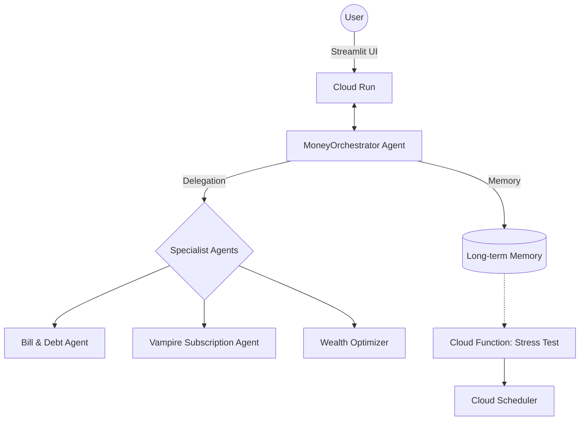

# 🛡️ Financial Guardian AI
**Your Autonomous GCP-Native Wealth Architect.**

[cite_start]Financial Guardian AI is an "always-on" personal money coach built for the **Gen AI Academy APAC Edition**[cite: 1]. [cite_start]It moves beyond reactive tracking to proactive wealth orchestration using a multi-agent system powered by **Vertex AI** and **Gemini 1.5 Pro**[cite: 23].

---

## 🚀 Unique Hook
Most finance apps show you what you've *already* spent. [cite_start]Financial Guardian AI looks forward[cite: 4]. [cite_start]It continuously monitors your liquidity, upcoming bills, and credit health to auto-rebalance your cash flow—moving surplus to savings or flagging "Vampire Subscriptions"—without you ever opening a spreadsheet[cite: 13, 15].

---

## 🏛️ Technical Architecture
[cite_start]The solution utilizes a **Primary Orchestrator** pattern to coordinate specialized sub-agents, ensuring a scalable and real-world deployment workflow[cite: 10, 23].



---

## ✨ Key Features
* [cite_start]**Multi-Agent Coordination**: A primary agent routes complex queries to specialized tools for Bills, Liquidity, and Anomaly Detection[cite: 15, 21].
* [cite_start]**Persistent Financial DNA**: Maintains long-term context (risk tolerance, goals, spending patterns) in **Firestore**, injected into every conversation via session state[cite: 8, 23].
* [cite_start]**Proactive Nightly Stress Test**: Uses **Cloud Functions** and **Cloud Scheduler** to run "Debt-Payoff Sprints" and flag cash-flow risks before they happen[cite: 10, 23].
* [cite_start]**GCP-Native Mock Bank**: Bypasses external API dependencies using a Firestore-backed `MockFinancialDataTool` for enhanced privacy and speed[cite: 8, 13].
* [cite_start]**Vampire Subscription Audit**: Automatically detects and alerts users to price hikes in recurring transactions[cite: 15].
* [cite_start]**Upcoming Debt Deadlines**: Dedicated monitoring of bills and payment dates to prevent late fees[cite: 15].

---

## 🛠️ Tech Stack
* [cite_start]**LLM/Agents**: Vertex AI (Gemini 1.5 Pro)[cite: 23].
* [cite_start]**Backend**: Python / FastAPI on Cloud Run[cite: 23].
* [cite_start]**Frontend**: Streamlit[cite: 23].
* [cite_start]**Database/Memory**: Firestore (NoSQL)[cite: 23].
* [cite_start]**Proactive Layer**: Cloud Functions + Cloud Scheduler[cite: 23].
* [cite_start]**Deployment**: Google Cloud Build[cite: 23].

---

## 🏁 Getting Started

### Prerequisites
* A GCP Project with billing enabled.
* `gcloud` SDK installed and authenticated.

### Deployment Steps
1.  **Clone the Repository**:
    ```bash
    git clone <your-repo-url>
    cd financial-guardian
    ```
2.  **Deploy to Cloud Run**:
    ```bash
    gcloud builds submit --tag gcr.io/[PROJECT_ID]/fin-guardian
    gcloud run deploy financial-guardian --image gcr.io/[PROJECT_ID]/fin-guardian --region us-central1 --allow-unauthenticated
    ```
3.  **Initialize the System**:
    [cite_start]Open the Cloud Run URL and click **"Initialize Demo System"** in the sidebar to seed the Firestore mock bank data[cite: 25].

---

## 📱 Demo Scenarios
1.  **The Windfall**: Ask "I just got a $2,300 bonus, what should I do?" [cite_start]The agent checks your goals and upcoming rent to suggest an investment split[cite: 9].
2.  **The Context Test**: Ask "Can I afford a trip to London?" followed by "I think it will cost 8000." [cite_start]The agent uses session memory to calculate affordability against your current balance[cite: 10].
3.  [cite_start]**The Bill Audit**: Ask "What bills do I have coming up?" to see the proactive monitor in action[cite: 15].

---
[cite_start]*Built for the Google Cloud Gen AI Academy - Build in APAC, Build for the World.* [cite: 1]
